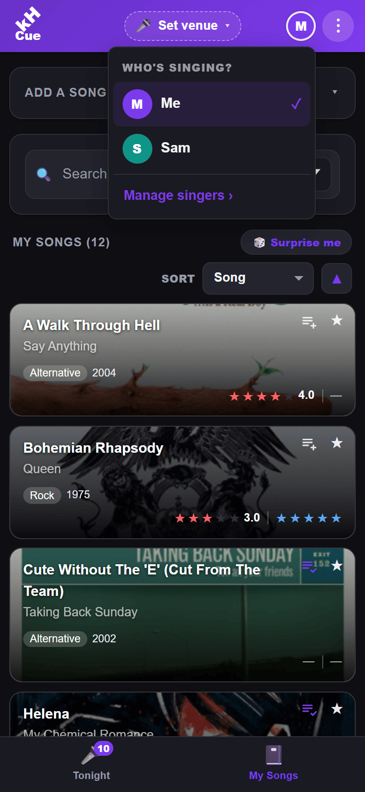

# 🎤 KHost Cue

> **You're on cue.** — the singer & patron companion app for [KHost](https://github.com/riddlemd/KHost), open-source karaoke host software.

KHost Cue is a cross-platform mobile app for **iOS and Android** that keeps a personal karaoke wishlist in your pocket. Add songs you'd love to sing, line up a set for the night, rate how each performance went, and look up lyrics on the spot — with your list stored **on your device**.

## 📸 Screenshots

  
  
  
   
  
  
  
   
  
  
  
  

## ✨ Features

- **Tonight set list** — build an on-deck set for the venue on its own tab: add songs, drag to reorder, and check each one off as you sing it, with live *“X of Y done”* progress. It's kept separate from your wishlist, so a song you sang earlier today stays unchecked until you check it off here. Your place in the list is kept as you switch tabs and come back.
- **Multiple singers, one device** — share the app with the whole table. Each singer keeps their own **My Songs** and **Tonight** set (and their own filters, sort and scroll position), while the **Venues** you sing at are shared. Tap the header **avatar** for a *“Who's singing?”* switch — no login, no accounts — and the whole app **re-tints to that singer's color** so you always know whose phone it is. Manage the roster (add, rename, pick a color or emoji avatar, remove) on the **Singers** page in the ⋮ menu — **press and hold** a singer there to switch to them, with a haptic tick to confirm; your last singer is remembered for next launch.
- **Venues** — keep a list of the places you sing, each with its own icon, optional KaraFun ID, notes, and location. An **active-venue chip** in the header shows where you are and switches with a tap, and on the Venues page a **press and hold** on any row makes it active (haptic-confirmed); the active venue **opens its KaraFun catalog** in one tap and **tags every song you log there**, so each venue builds up its own history — your go-to songs and recent sings at that spot. Add a venue by hand or by **scanning its KaraFun QR code**. It **auto-switches to the nearest saved venue** as you move between them (on by default, foreground only; a manual pick stays pinned until you resume auto-detect — toggle **Auto / Pinned** right in the switcher). Turn auto-switch off in Settings → *Venues*. Rarely-used venues can be **hidden from quick switch** (they stay on the Venues page and keep working) so the quick list stays short.
- **My Songs** — a personal wishlist of songs to sing, as a swipeable card list. One search box matches a song's title *or* artist; the rest of the filters (genre, tags, year, how-it-went / enjoyment rating) tuck behind a funnel button that opens them in a sheet — and each active one shows as a removable pill above the list. Sort by title, artist, rating, or date added. Your search, filters, sort, and scroll position stick as you switch tabs and come back. One tap on a card adds a song straight to tonight's set.
- **Ratings & history** — rate *every* performance (a "how it went" score) plus a separate **enjoyment** rating, jot per-performance notes, and keep a running sung-history for each song. A song's shown star is **confidence-weighted**: it blends the song's own record with your list's overall average, so a single lucky 5 doesn't outrank a solid ten-sing streak — and the more you sing something, the more its star trusts its own history. Optionally **weight recent sings more** (Settings → *Singing & ratings*) so your current form leads.
- **Lyrics** — look a song's lyrics up in-app from **[LRCLIB](https://lrclib.net/)** (no account needed) and cache them on-device so they open instantly next time.
- **Surprise me** — can't decide what to sing? One tap picks a song for you — gently weighted toward the ones you sing best (by that confidence-weighted star), and it can skip anything you've already sung today.
- **Quick links** — jump straight to any song on **YouTube** or **Spotify**, or search your venue on **KaraFun**. KaraFun search is per-venue, so set your venue once (Settings → *KaraFun*, or the first time you tap the button) and it remembers the venue ID — paste a link from your venue's KaraFun page, type the ID, or (on iOS/Android) **scan the venue's QR code**.
- **Favorites** — star the songs you love; they float to the top of the list.
- **Tags** — add your own free-form labels to a song — *duet*, *closer*, *needs practice* — shown as chips on the card and detail sheet. Reuse suggestions keep them tidy, and you can filter your list by tag (match *any* or *all* of the tags you pick). Switch tags off entirely in Settings → *Show song tags*.
- **Import & export** — three ways to move data, each in its own section. **Singer profiles**: export a singer's whole profile — their songs *and* sung history — to a `.json` file to move them to another device or keep a backup, and import one to add a singer here (ids are preserved, so re-importing updates the same singer rather than duplicating; tonight's set stays device-local). **Venues**: since venues are shared across singers, they export and import on their own, so a second device can pick up the same venue list. **Third-party import**: pull songs straight into your list from a public **Spotify** or **YouTube Music** playlist link. (A legacy songs-only `.json` export still imports, straight into the current singer.)
- **Auto-fill** — looks up a song's release year and genre automatically (via the iTunes Search API) so you don't have to type them.
- **Album art** — each song's cover is used as its card background — and behind the title on the song's detail sheet — with a dark fade behind the text for legibility. Covers are looked up from iTunes, with Deezer as a fallback for songs iTunes can't find (e.g. album deep cuts), and cached on-device; clear them from the Danger zone, or switch the whole thing off in Settings → *Show album art on cards*.
- **Update alerts** — tells you when a newer version is available (from the app's GitHub Releases) with a one-tap link to grab it.
- **Guided tour** — a first-run walkthrough introduces every feature one at a time — adding, searching, filtering and sorting your list; favorites, ratings, lyrics and quick links; tonight's set, venues (including the press-and-hold that makes one active), singers, importing/exporting, and Settings — so you're up and running fast. It seeds a few sample songs, a sample venue and a second singer while it runs, then clears them again, so every step has something real to point at. Replay it anytime from Settings.
- **Made to feel at home** — mobile-first layout, light & dark themes, and a tidy Settings screen where every extra behavior can be toggled off.

## 🚀 Getting started

Grab the latest `KHostCue-vX.Y.Z.apk` from [Releases](https://github.com/riddlemd/KHost.Mobile/releases) and sideload it on **Android** (you may need to allow installs from your browser or file manager). The app checks Releases itself and shows a banner when a newer version is out. On **iOS**, build from source for now.

> **Building from source or contributing?** See **[DEVELOPMENT.md](DEVELOPMENT.md)** for prerequisites, build & run commands, testing, project layout, and design notes.

## 🤝 Contributing

Issues and pull requests are welcome. Please keep changes focused and describe the behavior you're changing. See **[DEVELOPMENT.md](DEVELOPMENT.md)** for how to build and test, and **[AGENTS.md](AGENTS.md)** for coding conventions.

## 📄 License

KHost Cue is licensed under the [PolyForm Shield License 1.0.0](LICENSE) — the same license as [KHost](https://github.com/riddlemd/KHost).

You may use, modify, and self-host it for any purpose, **including commercial use** (for example, running it for your own karaoke events). You may **not** use it to provide a competing product or service — such as a hosted/managed offering (SaaS) or a rebranded redistribution — without a separate license. Commercial, SaaS, and OEM licenses are available; contact Michael Riddle <riddlemd@gmail.com>.

Third-party components bundled in the app are listed, with their licenses, in [THIRD-PARTY-NOTICES.md](THIRD-PARTY-NOTICES.md) (all MIT / Apache-2.0).
