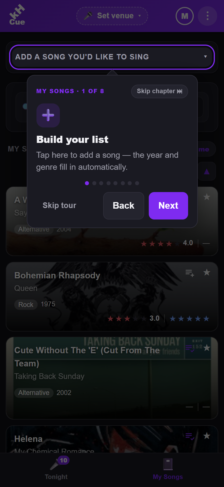
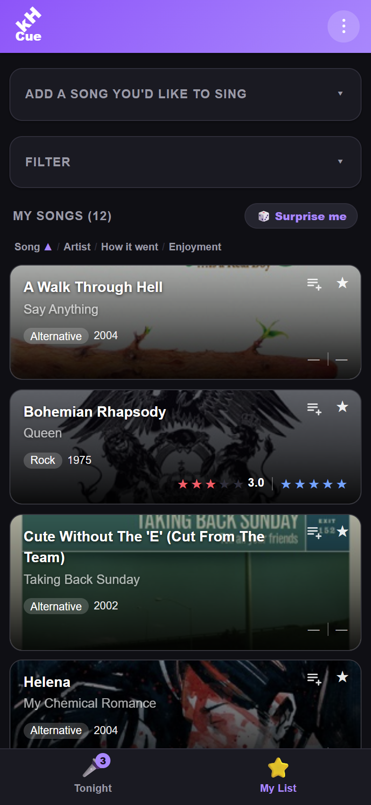
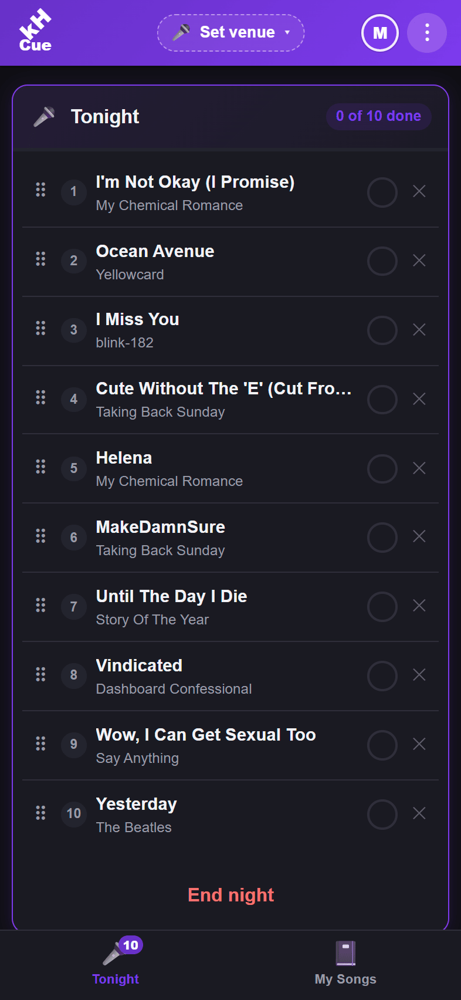
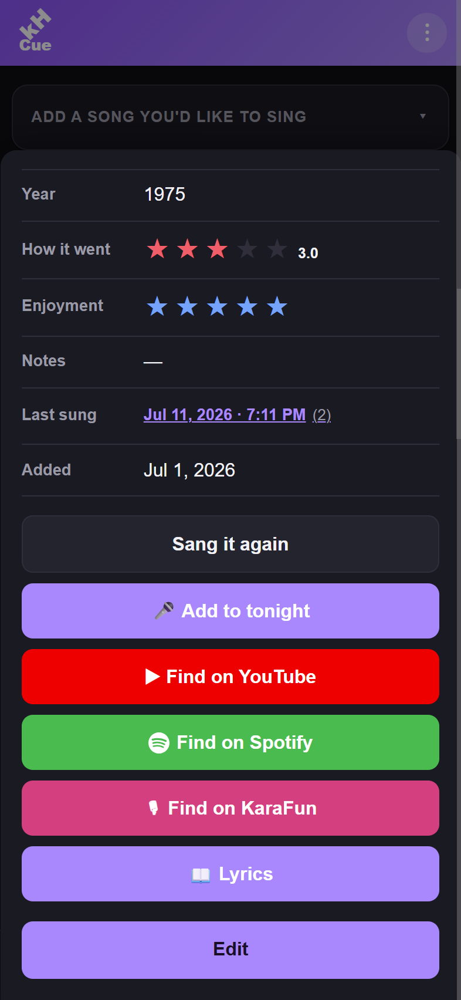
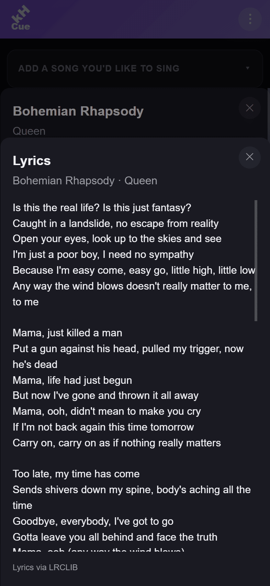
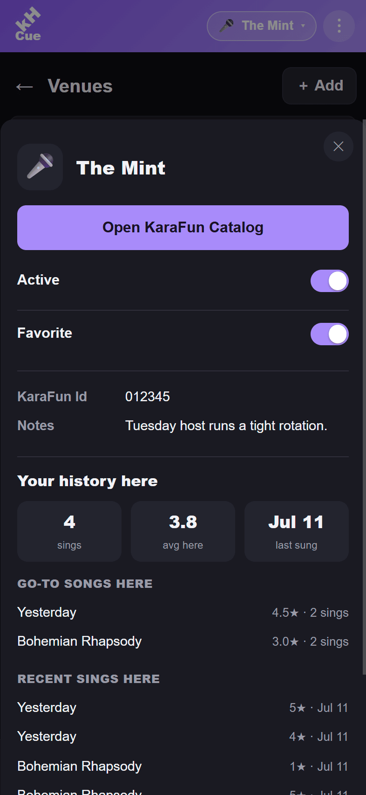
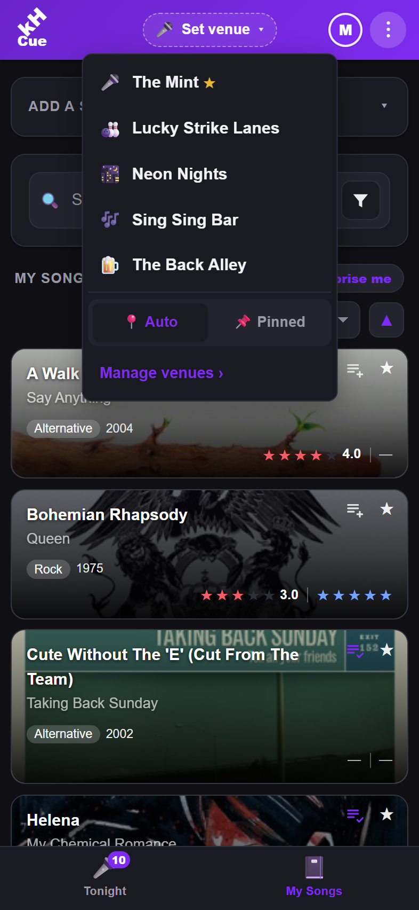
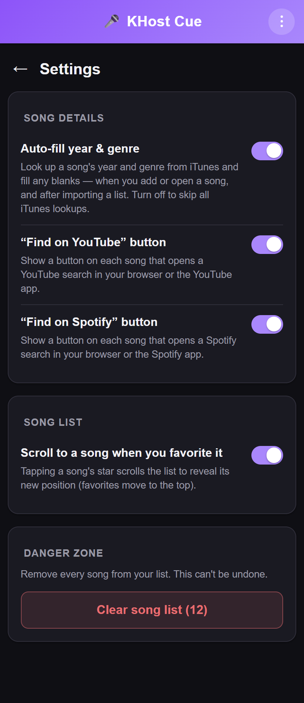
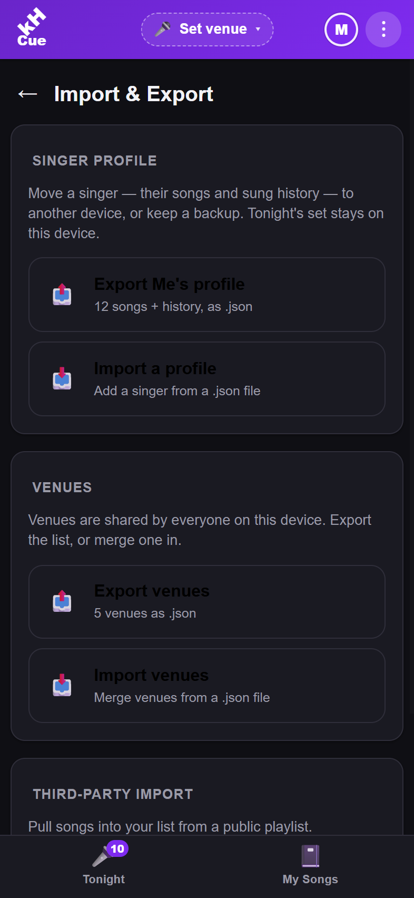

# 🎤 KHost Cue

> **You're on cue.** — the singer & patron companion app for [KHost](https://github.com/riddlemd/KHost), open-source karaoke host software.

[](#)
[](https://dotnet.microsoft.com/)
[](https://learn.microsoft.com/dotnet/maui/)
[](LICENSE)

KHost Cue is a cross-platform mobile app for **iOS and Android** that keeps a personal karaoke wishlist in your pocket. Add songs you'd love to sing, line up a set for the night, rate how each performance went, and look up lyrics on the spot — with your list stored **on your device**.

## 📸 Screenshots

<p align="center">
  
  
  
  <br />
  
  
  
  <br />
  
  
  
</p>

## ✨ Features

- **Tonight set list** — build an on-deck set for the venue on its own tab: add songs, drag to reorder, and check each one off as you sing it, with live *“X of Y done”* progress. It's kept separate from your wishlist, so a song you sang earlier today stays unchecked until you check it off here. Your place in the list is kept as you switch tabs and come back.
- **Multiple singers, one device** — share the app with the whole table. Each singer keeps their own **My Songs** and **Tonight** set (and their own filters, sort and scroll position), while the **Venues** you sing at are shared. Tap the header **avatar** for a *“Who's singing?”* switch — no login, no accounts — and the whole app **re-tints to that singer's color** so you always know whose phone it is. Manage the roster (add, rename, pick a color or emoji avatar, remove) on the **Singers** page in the ⋮ menu; your last singer is remembered for next launch.
- **Venues** — keep a list of the places you sing, each with its own icon, optional KaraFun ID, notes, and location. An **active-venue chip** in the header shows where you are and switches with a tap; the active venue **opens its KaraFun catalog** in one tap and **tags every song you log there**, so each venue builds up its own history — your go-to songs and recent sings at that spot. Add a venue by hand or by **scanning its KaraFun QR code**. It **auto-switches to the nearest saved venue** as you move between them (on by default, foreground only; a manual pick stays pinned until you resume auto-detect — toggle **Auto / Pinned** right in the switcher). Turn auto-switch off in Settings → *Venues*. Rarely-used venues can be **hidden from quick switch** (they stay on the Venues page and keep working) so the quick list stays short.
- **My Songs** — a personal wishlist of songs to sing, as a swipeable card list. One search box matches a song's title *or* artist; the rest of the filters (genre, tags, year, how-it-went / enjoyment rating) tuck behind a funnel button that opens them in a sheet — and each active one shows as a removable pill above the list. Sort by title, artist, rating, or date added. Your search, filters, sort, and scroll position stick as you switch tabs and come back. One tap on a card adds a song straight to tonight's set.
- **Ratings & history** — rate *every* performance (a "how it went" score that averages over time) plus a separate **enjoyment** rating, jot per-performance notes, and keep a running sung-history for each song.
- **Lyrics** — look a song's lyrics up in-app from **[LRCLIB](https://lrclib.net/)** (no account needed) and cache them on-device so they open instantly next time.
- **Surprise me** — can't decide what to sing? One tap picks a random song for you — and it can skip anything you've already sung today.
- **Quick links** — jump straight to any song on **YouTube** or **Spotify**, or search your venue on **KaraFun**. KaraFun search is per-venue, so set your venue once (Settings → *KaraFun*, or the first time you tap the button) and it remembers the venue ID — paste a link from your venue's KaraFun page, type the ID, or (on iOS/Android) **scan the venue's QR code**.
- **Favorites** — star the songs you love; they float to the top of the list.
- **Tags** — add your own free-form labels to a song — *duet*, *closer*, *needs practice* — shown as chips on the card and detail sheet. Reuse suggestions keep them tidy, and you can filter your list by tag (match *any* or *all* of the tags you pick). Switch tags off entirely in Settings → *Show song tags*.
- **Import & export** — pull songs from a public **Spotify** or **YouTube Music** playlist link, or a KHost Cue `.json` file, and export your whole list back out.
- **Auto-fill** — looks up a song's release year and genre automatically (via the iTunes Search API) so you don't have to type them.
- **Album art** — each song's cover is used as its card background — and behind the title on the song's detail sheet — with a dark fade behind the text for legibility. Covers are looked up from iTunes, with Deezer as a fallback for songs iTunes can't find (e.g. album deep cuts), and cached on-device; clear them from the Danger zone, or switch the whole thing off in Settings → *Show album art on cards*.
- **Update alerts** — tells you when a newer version is available (from the app's GitHub Releases) with a one-tap link to grab it.
- **Guided tour** — a first-run walkthrough introduces every feature one at a time — adding, searching, filtering and sorting your list; favorites, ratings, lyrics and quick links; tonight's set, venues, importing/exporting, and Settings — so you're up and running fast. Replay it anytime from Settings.
- **Made to feel at home** — mobile-first layout, light & dark themes, and a tidy Settings screen where every extra behavior can be toggled off.

## 🛠️ Tech stack

- **[.NET 10](https://dotnet.microsoft.com/)** with **[.NET MAUI Blazor Hybrid](https://learn.microsoft.com/dotnet/maui/)** — native iOS/Android shell hosting a Razor (Blazor) UI.
- On-device storage in JSON files behind interfaces (`ISongListStore`, `ITonightStore`, `IVenueStore`, `ISingerStore`, `ILyricsCache`) that keep storage concerns out of the UI. The song-list and tonight stores are namespaced per singer, so each person's lists live in their own file.

## 🚀 Getting started

### Prerequisites

- **.NET 10 SDK** with the MAUI workload:
  ```bash
  dotnet workload install maui
  ```
- **Android**: the Android SDK and an emulator or a connected device.
- **iOS**: a paired Mac (iOS cannot be built on Windows).

### Build & run

```bash
# Android
dotnet build KHost.Mobile/KHost.Mobile.csproj -f net10.0-android "-p:BaseOutputPath=./obj/_build"

# Deploy and launch on a connected Android device / emulator
dotnet build KHost.Mobile/KHost.Mobile.csproj -t:Run -f net10.0-android "-p:BaseOutputPath=./obj/_build"

# Run on Windows — the quickest way to iterate on the Blazor UI (no emulator needed)
dotnet run --project KHost.Mobile -f net10.0-windows10.0.19041.0 "-p:BaseOutputPath=./obj/_build"
```

> `-p:BaseOutputPath=./obj/_build` keeps build output out of the IDE's `bin/` folder so it doesn't get locked while the IDE is open.

### Sample data for testing

Need songs to populate the list while testing? This public **YouTube Music** playlist imports cleanly via **Import & Export → YouTube Music**:

```
https://music.youtube.com/playlist?list=PLrB1lrYJ3YfvS2ZaTJZ_D8vvIv_fowkNM
```

## 🧑‍💻 Development

### Screenshots

**Screenshot / mobile-preview target size:** **786 × 1704 px** — a **393 × 852** (iPhone 15/16) viewport at **2× device-pixel-ratio**. Capture screenshots and size the mobile preview to this so everything lines up with the screenshot grid.

### Testing

Two xUnit projects, split by what they touch. Both must pass before any commit:

```bash
# Unit tests — pure, no-I/O logic (playlist/metadata/lyrics parsers, Genres.Map, SongListItem computed properties)
dotnet test KHost.Mobile.UnitTests/KHost.Mobile.UnitTests.csproj "-p:BaseOutputPath=./obj/_build"

# Integration tests — the JSON stores against a real temp folder (real file I/O + serialization)
dotnet test KHost.Mobile.IntegrationTests/KHost.Mobile.IntegrationTests.csproj "-p:BaseOutputPath=./obj/_build"
```

Neither test project needs the MAUI workload: they target plain `net10.0`. The MAUI-free source they cover (models, stores) is pulled in via linked `<Compile>` since a `net10.0` project can't reference the MAUI head. The stores' only device dependency — the app-data folder — is abstracted behind `IAppDataDirectory`, which the integration tests point at a throwaway temp directory.

## 📁 Project structure

| Project | Role |
|---|---|
| `KHost.Mobile` | The MAUI Blazor Hybrid app — a thin native shell hosting the Razor UI in `Components/`. |
| `KHost.Mobile.Clients` | Client library: playlist import (Spotify / YouTube Music), iTunes metadata lookup, Deezer cover-art fallback, and LRCLIB lyrics lookup. |
| `KHost.Mobile.UnitTests` | xUnit unit tests for the pure, no-I/O logic (parsers, `Genres`, `SongListItem`). |
| `KHost.Mobile.IntegrationTests` | xUnit integration tests for the JSON stores against a real temp folder, via a fake `IAppDataDirectory`. |

## 🤝 Contributing

Issues and pull requests are welcome. Please keep changes focused and describe the behavior you're changing.

## 📄 License

KHost Cue is licensed under the [PolyForm Shield License 1.0.0](LICENSE) — the same license as [KHost](../KHost).

You may use, modify, and self-host it for any purpose, **including commercial use** (for example, running it for your own karaoke events). You may **not** use it to provide a competing product or service — such as a hosted/managed offering (SaaS) or a rebranded redistribution — without a separate license. Commercial, SaaS, and OEM licenses are available; contact Michael Riddle <riddlemd@gmail.com>.

Third-party components bundled in the app are listed, with their licenses, in [THIRD-PARTY-NOTICES.md](THIRD-PARTY-NOTICES.md) (all MIT / Apache-2.0).
